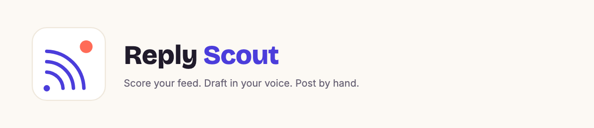

A Chrome extension for x.com that turns your feed into a scored, draftable queue instead of an endless scroll. It reads whatever's on your screen, scores each post against a thesis and rubric you write, and drafts a reply in your own voice for anything worth engaging. You edit, copy, and post by hand — it never posts, likes, or follows for you.

No X API needed — it only sees what your logged-in browser already renders. Works with the Claude API or a fully local model (LM Studio), your choice.

## Install (2 minutes)

1. Unzip this folder somewhere permanent (Chrome loads it from disk, so don't delete it later).
2. Open `chrome://extensions` in Chrome.
3. Turn on **Developer mode** (toggle, top right).
4. Click **Load unpacked** and select the `reply-scout` folder.
5. Click the Reply Scout icon (or the Settings link in the panel) to open settings:
   - Paste your **Anthropic API key** (create one at console.anthropic.com → API keys) — or switch the provider to **Local** and point it at LM Studio instead.
   - Edit the prefilled **thesis** and **rubric** until they're truly yours.
   - Paste 3–8 real writing samples into **Voice samples** — this is what makes drafts sound like you instead of like AI.
6. Go to x.com. The panel appears top-right.

## Daily loop (~10 minutes)

1. Open **x.com/home** or one of your X **Lists** (these are your monitoring feeds — the panel only appears here).
2. Scroll until a screenful of candidate posts is visible.
3. Click **Scan visible posts**. Up to 15 posts are scored per scan.
4. Review the results, sorted by score. For anything with a draft:
   - Edit the draft in the textarea — you are the last filter, always.
   - **Copy reply**, then **Open post** (or **Find on page**), and paste + post by hand.
5. Scroll further or switch feeds and scan again.

## Morning digest (optional)

A separate, one-click feature answering a different question than reply-scoring: not "should I reply to this," but "what's actually worth reading right now."

1. Open `x.com/home` or a List.
2. Click **Generate digest** in the panel. The page scrolls itself, loading posts at a human-like pace, until it's collected ~120 or the feed runs out.
3. Once enough posts are in, get up to 8 items — link, two-line summary, why it matters — plus **Today's move**: one ready-to-send draft, either a reply to whichever single post is most worth responding to, or a standalone post idea if nothing individually qualifies. Copy it straight from the panel.

Configure what it looks for in settings → **Digest focus** (prefilled with a starter framing; edit it to match your own role and interests — it's your words, not a fixed rubric).

How the digest works under the hood

- **Manual only, never automatic.** It only starts when you click the button, and it only scrolls *your own already-open, logged-in tab* while you're there watching — no unattended scheduling, no stored credentials, no background scraping while you're away. Auto-scan is automatically paused for the run and resumes exactly as it was once the digest finishes.
- **Pulls in fresh posts first.** If X is showing a "Show N posts" prompt, it gets clicked automatically before scrolling down for older content.
- **Scans in batches for larger pools.** With more than ~25 posts collected, it first shortlists candidates from each batch independently, then runs the full digest format only over the merged shortlist. Expect this to take a couple of minutes on a local model; the button shows live progress the whole time.
- **Separate pipeline from reply-scoring**: its own prompt, no image handling.
- **Skips repeats**: anything already surfaced in a digest within the last ~3 days is filtered out locally before it's even sent to the model.
- **X only.** LinkedIn isn't supported — different site, different markup.

## Using a local model instead of the API

Set provider to **Local** in settings and point it at your LM Studio server (defaults to `http://localhost:1234/v1`). Two model slots matter:

- **Scoring/drafting model** — reasoning models can quietly burn most of their token budget on hidden "thinking" before writing the actual answer, which shows up as truncated responses or drafts that ignore your rubric simply because there was no budget left to apply it. **gpt-oss-20b** has tested well here; the extension already sends `reasoning_effort: "low"` plus a generous token budget to keep this in check on models that support it.
- **OCR model** (optional, for image-heavy posts) — a dedicated vision model transcribes images so your main model can stay text-only. **`allenai/olmOCR-2-7B-1025`** (document/screenshot-focused) or **`lmstudio-community/Qwen2-VL-2B-Instruct-GGUF`** (lighter, more general) both work; set it in settings → **OCR model for images**.

Full details on image handling

- **Image alt text:** always on, free. If a post's photo has an author-provided alt/description, it's folded into the post's text before scoring — no image fetch, no cost, works with any model.
- **Images:** off by default. Turn on **Include images when scoring** in settings to also process each post's own photo or video thumbnail (not quoted-tweet or link-preview images). What happens next depends on provider:
  - **Anthropic:** the image is sent directly to Claude as part of the scoring request.
  - **Local, no OCR model set:** the image is sent directly to whatever model is loaded — it must support vision itself (e.g. Qwen2-VL, LLaVA), or LM Studio will error.
  - **Local, with an OCR model set:** the image is transcribed first by that dedicated model, and the extracted text is folded into the post like alt text — your main scoring model never needs vision support. Any model id containing "olmocr" automatically gets a tuned document-transcription prompt; everything else gets a simpler general-purpose describe/transcribe prompt.
  - **Not every image gets processed, even with the setting on.** Only posts with short text (under ~40 characters) trigger an image fetch — a substantial caption already gives the scorer enough. Video poster frames are always skipped. Each batch processes at most 6 images.
- **Cost:** each scan is one small API call — typically a fraction of a cent with images off.

## Notes

Where it's active, privacy, reliability, and other details

- **Where it's active:** the panel only appears on `x.com/home` and individual List timelines (`x.com/i/lists/...`). It stays off on profile pages, single-post pages, search, and everywhere else.
- **Ads:** promoted posts are detected and skipped before they're ever sent for scoring.
- **Privacy:** your key and settings live in Chrome's local extension storage. Post text (and, if enabled, post images) is sent only to api.anthropic.com, or to your own local LM Studio server.
- **X DOM changes:** X occasionally renames its internal markup. If scanning suddenly finds nothing, the selectors in `content.js` may need updating. With **Warn if X's layout seems to have changed** on (default), the panel surfaces this itself instead of silently finding nothing.
- **Reply context:** when X shows a "Replying to @user" line above a reply surfaced in a feed/list, it's captured and included, so the scorer isn't judging a reply blind to what it's responding to.
- **Backlog cap:** if local scoring can't keep up with how fast you're scrolling, the queue stops growing past 150 posts — the status line shows "backlog full," and unscored posts get reconsidered once it drains.
- **Dedup survives a reload:** recently-scored posts are remembered for ~2 days, so a refresh won't re-score — and re-pay for — the same posts.
- **Draft quality stat:** settings shows a running "N of M drafted replies copied" figure — a rough, free signal on whether your rubric is producing drafts you actually use.
- **Resilience:** all network requests time out rather than hanging forever, and the background worker stays alive for the duration of long local-model calls. Scoring and digest results are delivered as independent, tab-targeted messages rather than a single long-lived callback. An idle timeout catches the rare case where the background worker dies mid-task (an MV3 risk) and fails visibly instead of leaving the panel looking frozen.
- **Stay hand-on-the-wheel:** the copy-only design is deliberate. Automated posting from a session is against X's rules and would undercut the whole point — replies only work when they're genuinely yours.

## Files

- `manifest.json` — extension config (Manifest V3)
- `content.js` / `content.css` — the on-page panel and post extraction
- `background.js` — model calls and scoring/drafting prompts
- `options.html` / `options.js` — settings: API key, thesis, rubric, voice, score threshold

## Privacy

[Privacy Policy](https://vijaybw.github.io/reply-scout/privacy.html) — what's stored, what's sent externally, and what Reply Scout never does.
